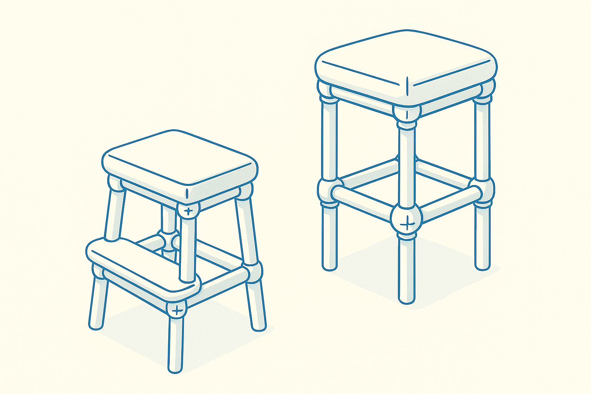
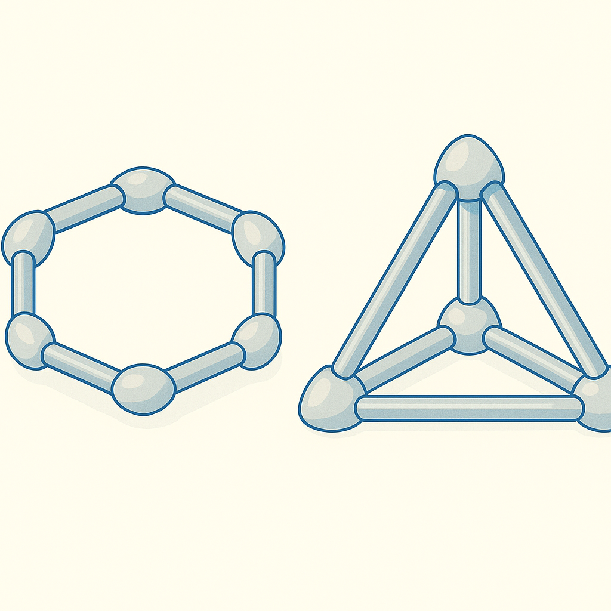

<h1>🌀 Morph0</h1>

<em>Objet morphologique modulaire : tiges + coussins gonflables • open-hardware / open-docs</em>

---

## 💡 Concept

**Morph0** est un projet open-source visant à créer un objet physique capable de **changer de forme** à la demande.  
Il combine :

* **Tiges flexibles / alliage à mémoire de forme** – rôle d’“os”  
* **Coussins gonflables** – rôle de “muscles” souples  
* **Microcontrôleur basse conso + BLE** – application mobile pour déclencher les morphologies

Cas d’usage envisagés : coussin de poche, poignée, support téléphone, jouet éducatif, petit mobilier adaptable…

  
  

---

## 🔖 Licence

* **Code** : MIT  
* **Documentation & médias** : **CC BY-NC-SA 4.0** – usage **non commercial** gratuit avec attribution  
* **Usage professionnel / commercial** (produit vendu, prestation payante, R&D propriétaire, etc.) **→ licence commerciale unique** (4 000 €/an) :  
  <https://scgfamp.lemonsqueezy.com/buy/8430de49-9b31-4802-a4e6-0b24f7f69aad>

Détails complets dans [`governance/DUAL_LICENSE.md`](governance/DUAL_LICENSE.md).

---

## 📁 Arborescence

| Dossier | Contenu |
|---------|---------|
| `docs/` | notes concept, add-ons, recherches pilotage |
| `governance/` | licences, position légale, code de conduite, guide de contribution |

---

## 🤝 Contribuer

Toutes les aides sont les bienvenues !  
Modèle FreeCAD basique, revue KiCad, maquette UI mobile… :

1. Lire [`governance/CONTRIBUTING.md`](governance/CONTRIBUTING.md)  
2. Choisir une **issue** marquée _good first issue_ ou en créer une  
3. Fork → branche → PR

Toute contribution est intégrée sous le même régime de double licence.

---

## 💬 Communauté & Support

* Questions → [GitHub Discussions](https://github.com/f-buisson/Morph0/discussions)  
* Dev-logs courts sur **X/Twitter** : `@scgfamp`  
* Demandes pro : **scgfamp@hotmail.com**

---

> ### ⚠️ Avertissement – Faisabilité
> Les projets sont publiés à un stade **idée / R&D ouverte**.  
> Certaines fonctions décrites peuvent exiger des moyens, matériaux ou
> compétences avancés et **ne pas être réalisables** dans l’état actuel du hobby
> ou de l’auteur. L’objectif est d’explorer des pistes, d’inspirer des makers et
> de documenter l’antériorité.  
> Contributeurs et partenaires sont invités à tester, adapter et prouver – ou
> infirmer – ces concepts. Aucune garantie de résultat, de coûts ou de délais
> n’est fournie.

---

© 2025 Fabien Bui
sson — Projet open-innovation

---

<h1>🌀 Morph0</h1>

<em>Modular morphing object: rods + inflatable cushions • open-hardware / open-docs</em>

---

## 💡 Concept

**Morph0** is an open-source project aiming to create a physical object that can **change shape on demand**.  
It combines :

* **Flexible rods / shape-memory alloy** – act as “bones”  
* **Inflatable cushions** – act as soft “muscles”  
* **Low-power micro-controller + BLE** – mobile app triggers the morphs

Envisioned use-cases: pocket cushion, handle, phone stand, educational toy, small adaptable furniture …

  
  

---

## 🔖 Licence

* **Code:** MIT  
* **Documentation & media:** **CC BY-NC-SA 4.0** – free **non-commercial** use with attribution  
* **Professional / commercial use** (product sales, paid services, proprietary R&D, etc.) **→ single commercial licence** (€ 4 000 / year):  
  <https://scgfamp.lemonsqueezy.com/buy/8430de49-9b31-4802-a4e6-0b24f7f69aad>

Full terms in [`governance/DUAL_LICENSE.md`](governance/DUAL_LICENSE.md).

---

## 📁 Repository structure

| Folder | Content |
|--------|---------|
| `docs/` | concept notes, add-ons, shape-control research |
| `governance/` | licences, legal stance, code of conduct, contribution guide |

---

## 🤝 Contributing

All help is welcome!  
Basic FreeCAD model, KiCad review, mobile UI mock-up …

1. Read [`governance/CONTRIBUTING.md`](governance/CONTRIBUTING.md)  
2. Pick a **_good first issue_** or open a new one  
3. Fork → branch → PR

Every contribution is merged under the same dual-licence scheme.

---

## 💬 Community & Support

* Questions → [GitHub Discussions](https://github.com/f-buisson/Morph0/discussions)  
* Short dev-logs on **X/Twitter**: `@scgfamp`  
* Business enquiries: **scgfamp@hotmail.com**

---

> ### ⚠️ Feasibility Disclaimer  
> Projects are published at an **idea / open R&D** stage.  
> Some described functions may require advanced means, materials or skills and
> **may not yet be feasible** at hobbyist level or for the author alone.  
> Goal: explore possibilities, inspire makers and document prior art.  
> Contributors and partners are invited to test, adapt and confirm—or disprove—
> these concepts. No guarantee of results, costs or timelines is provided.

---

© 2025 Fabien Buisson — open-innovation project

